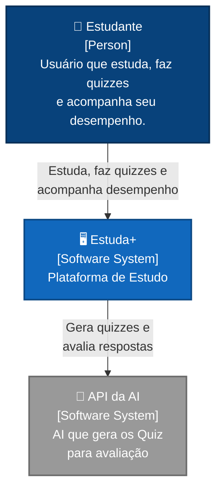
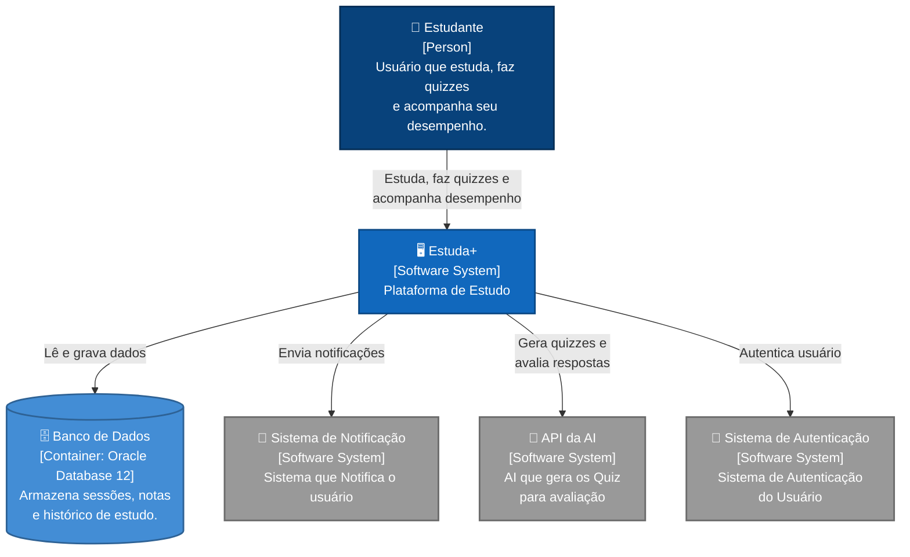

# Estuda+ — Documentação de Arquitetura (Arc42)

> **Proposta de Valor:** "Não apenas conte as horas, teste a sua absorção."

---

## Integrantes do Grupo

| Nome               |
|--------------------|
| *Fernando Chociai* | 
| *Gabriel Coltre* | 
| *João Marcelo* |
| *João Franze* |
| *Leander Hallu* |

---

## 1. Introdução e Metas

### 1.1 Visão Geral do Sistema

O **Estuda+** é um software de organização e medição da qualidade e quantidade do estudo. Ele combina cronometragem do tempo de estudo com avaliações geradas por Inteligência Artificial para mensurar, de fato, o quanto o estudante absorveu do conteúdo.

#### Quatro Pilares

1. **Medição Quantitativa** — Cronometrar o tempo líquido de estudo.
2. **Contextualização de Estudo** — Registro do tema estudado (input do usuário).
3. **Avaliação Qualitativa (IA)** — Verificação de conhecimento pós-estudo através de perguntas dinâmicas.
4. **Indicador de Eficiência** — Cruzamento de Tempo × Acertos.

### 1.2 Requisitos Funcionais Essenciais

#### Gestão de Sessão e Tempo

| ID   | Requisito              | Descrição                                                                                          |
|------|------------------------|------------------------------------------------------------------------------------------------------|
| RF01 | Registro de Tema       | Permite ao usuário informar o tópico de estudo antes de iniciar a sessão.                           |
| RF02 | Cronômetro de Estudo   | Cronômetro com funções de iniciar, pausar e finalizar para medir o tempo líquido de estudo.         |
| RF03 | Armazenamento de Tempo | Grava a duração total da sessão vinculada ao tema informado.                                         |

#### Integração com IA

| ID   | Requisito                  | Descrição                                                                                      |
|------|----------------------------|--------------------------------------------------------------------------------------------------|
| RF04 | Geração de Quiz Dinâmico   | Ao finalizar a sessão, envia o tema para uma API de IA e gera de 3 a 5 perguntas automaticamente. |
| RF05 | Formatos de Questões       | Suporta perguntas de múltipla escolha e perguntas abertas conforme retorno da IA.               |
| RF06 | Avaliação de Respostas     | Processa respostas do usuário pela IA para verificar correção e nível de compreensão.           |

#### Mensuração de Qualidade

| ID   | Requisito             | Descrição                                                                                          |
|------|-----------------------|------------------------------------------------------------------------------------------------------|
| RF07 | Nota de Absorção      | Gera uma nota de 0 a 10 baseada no desempenho do quiz pós-estudo.                                  |
| RF08 | Feedback de Lacunas   | Exibe explicação da IA sobre erros e pontos que o usuário ainda não domina.                         |
| RF09 | Índice de Eficiência  | Calcula a relação entre tempo gasto e nota obtida: `E = Nota / Tempo (horas)`.                      |

#### Histórico e Visualização

| ID   | Requisito                | Descrição                                                                                       |
|------|--------------------------|---------------------------------------------------------------------------------------------------|
| RF10 | Histórico de Sessões     | Mantém log com data, tema, tempo gasto e nota de qualidade de todos os estudos.                  |
| RF11 | Dashboard de Desempenho  | Gráficos que mostram a evolução da retenção por matéria ao longo do tempo.                       |
| RF12 | Filtro de Revisão Crítica| Lista os temas com menores notas de absorção, indicando necessidade de revisão.                  |

### 1.3 Metas de Qualidade

| Prioridade | Meta de Qualidade        | Descrição                                                                                                            |
|------------|--------------------------|------------------------------------------------------------------------------------------------------------------------|
| 1          | **Usabilidade**          | Interface simples e direta — uma tela principal com cronômetro e campo de texto, sem menus complexos.                 |
| 2          | **Confiabilidade da IA** | As perguntas geradas e avaliações devem ser relevantes e tecnicamente precisas para o tema estudado.                  |
| 3          | **Desempenho**           | A geração de quizzes deve ocorrer em tempo aceitável (< 10s) após a finalização da sessão.                            |
| 4          | **Acessibilidade**       | Compatibilidade com leitores de tela, botões grandes e alto contraste para uso em dispositivos móveis e baixa visão.  |
| 5          | **Manutenibilidade**     | O código deve ser modular o suficiente para trocar o provedor de IA sem impactar o restante do sistema.               |

### 1.4 Stakeholders

| Stakeholder                    | Papel / Expectativa                                                                                                  |
|--------------------------------|-----------------------------------------------------------------------------------------------------------------------|
| **Estudantes (usuário final)** | Usuários primários. Esperam uma ferramenta simples para medir tempo de estudo e receber feedback rápido sobre absorção.|
| **Professores / Orientadores** | Interessados em acompanhar ou recomendar o uso da ferramenta para seus alunos.                                        |
| **Equipe de Desenvolvimento**  | Responsável por projetar, implementar e manter o sistema. Precisa de clareza nas decisões técnicas.                   |
| **Provedor de IA (API externa)**| Fornece o serviço de geração de perguntas e avaliação de respostas (ex.: Google Gemini API).                          |

---

## 2. Regras e Restrições

### 2.1 Restrições Técnicas

| ID   | Restrição                          | Descrição                                                                                                                       |
|------|------------------------------------|---------------------------------------------------------------------------------------------------------------------------------|
| RT01 | API de IA externa                  | O sistema depende de uma API de IA de terceiros (ex.: Google Gemini) para gerar perguntas e avaliar respostas. Não haverá modelo de IA local. |
| RT02 | Aplicação Web                      | O sistema será desenvolvido como aplicação web, acessível por navegadores modernos em desktop e dispositivos móveis.             |
| RT03 | Banco de dados relacional ou NoSQL | O histórico de sessões e notas deve ser persistido em um banco de dados com suporte a consultas por usuário e tema.              |
| RT04 | Conexão com a Internet obrigatória | A funcionalidade de geração de quiz e avaliação requer acesso à Internet para comunicação com a API de IA.                       |
| RT05 | Idioma Português                   | A interface do sistema e as perguntas geradas devem estar em português brasileiro.                                                |

### 2.2 Restrições Organizacionais

| ID   | Restrição                          | Descrição                                                                                                                       |
|------|------------------------------------|---------------------------------------------------------------------------------------------------------------------------------|
| RO01 | Projeto acadêmico                  | O sistema é desenvolvido como trabalho de disciplina, com prazo definido pelo calendário acadêmico.                              |
| RO02 | Equipe reduzida                    | A equipe é composta por poucos integrantes com conhecimento generalista, sem especialistas dedicados por área.                    |
| RO03 | Custo zero ou mínimo               | Devem ser utilizadas ferramentas, frameworks e APIs em camada gratuita (free tier) ou open-source.                                |

### 2.3 Convenções

| ID   | Convenção                          | Descrição                                                                                                                       |
|------|------------------------------------|---------------------------------------------------------------------------------------------------------------------------------|
| CV01 | Padrão de código                   | O código segue as convenções e boas práticas da linguagem e framework adotados.                                                  |
| CV02 | Documentação em Markdown           | Toda a documentação arquitetural segue o template Arc42 em formato Markdown.                                                     |
| CV03 | Diagramas em Mermaid               | Os diagramas de arquitetura utilizam a sintaxe Mermaid para fácil manutenção e versionamento junto ao código.                    |

---

## 3. Visão de Contexto

### 3.1 Contexto de Negócio

O **Estuda+** posiciona-se como uma ferramenta pessoal de estudo. O estudante é o ator principal que interage com o sistema para registrar sessões de estudo e receber feedback inteligente. O sistema comunica-se com serviços externos de IA, notificação e autenticação.

#### Interfaces Externas

| Parceiro de Comunicação       | Entrada (para o Estuda+)                                    | Saída (do Estuda+)                                                  |
|-------------------------------|--------------------------------------------------------------|----------------------------------------------------------------------|
| **Estudante**                 | Tema de estudo, controle do cronômetro, respostas do quiz    | Perguntas do quiz, nota de absorção, feedback de lacunas, dashboard  |
| **API da AI**                 | Perguntas geradas, avaliação das respostas, feedback         | Tema estudado, tempo de estudo, respostas do estudante               |
| **Sistema de Notificação**    | Confirmação de entrega                                       | Alertas de revisão, lembretes de estudo                              |
| **Sistema de Autenticação**   | Token de autenticação, dados do usuário                      | Credenciais de login                                                 |
| **Banco de Dados**            | Sessões, notas e histórico armazenados                       | Dados de sessão, tema, tempo e nota para gravação                    |

### 3.2 Diagrama C4 — Nível 1 

### 3.2 Diagrama C4 — Nível 2 

### 3.3 Mapeamento dos Canais Técnicos

| De               | Para                     | Protocolo / Tecnologia | Descrição                                                                    |
|------------------|--------------------------|------------------------|-------------------------------------------------------------------------------|
| Estudante        | Estuda+                  | HTTPS                  | Acesso via navegador web (desktop ou móvel).                                  |
| Estuda+          | Banco de Dados           | SQL / Driver nativo    | Persistência de sessões, notas, temas e dados do usuário.                     |
| Estuda+          | API da AI                | HTTPS / REST (JSON)    | Envio do tema para geração de quiz; envio de respostas para avaliação.        |
| Estuda+          | Sistema de Notificação   | HTTPS / REST (JSON)    | Envio de alertas de revisão e lembretes ao estudante.                         |
| Estuda+          | Sistema de Autenticação  | HTTPS / OAuth 2.0      | Autenticação e autorização do usuário.                                         |
